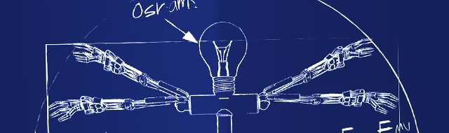

# 

## DESCRIPTION
- Diablo 4 combat assistant, pixel bot and toolbox.
- Set up a combat rotation and let the assistant do the combat. 90% accurate
- Set up a combat rotation and let the helltide-bot do the combat, pathing and looting. 60% accurate
- Use the macro recorder/player to get a waypoint file and let the robot do the combat, pathing and looting. ??% accurate

## PARAMETER
- Recomended use of windowed fullscreen with 1920x1080 resolution.
- Recomended use of US/EN or standard keyboard layout.
- Set key assignment in config.yml
- Set monster health bar -> always on
- Set basic skill on left mouse and core skill on right mouse
- English language required for pickit
- Python 3.9 interpreter, see requirements.txt

## USAGE
- Recomended usage is the assistant in combination with the toolbox to build a custom skill rotation,
    just use folder names, in assets\skills\ like: barb, necro, sorc and assign the proper skill image
    to the correct number: 01-04 from left to right and 05 for your right mouse button.
    Take a look at src\engine\combat.py and expand the function to your needs.
- Start the helltide-bot somewhere in the openworld, optimal in onyx watchtower or rakhat keep.
- Use the macro recorder atm for testing purpose.
- With toolbox open: 'home' hotkey get coordinates and rgb colors at mouse cursor.
- With toolbox open: 'insert' hotkey save image per parameters from gui at mouse cursor.
- 'end' hotkey exit active process.
- 'delete' hotkey pause active process.

## CREDITS
- https://stackoverflow.com/
- https://github.com/
- Written in Python by DarkDBx

Support me: https://patreon.com/DarkDBx
Tips here: https://paypal.me/darkdb?country.x=CH&locale.x=de_DE

